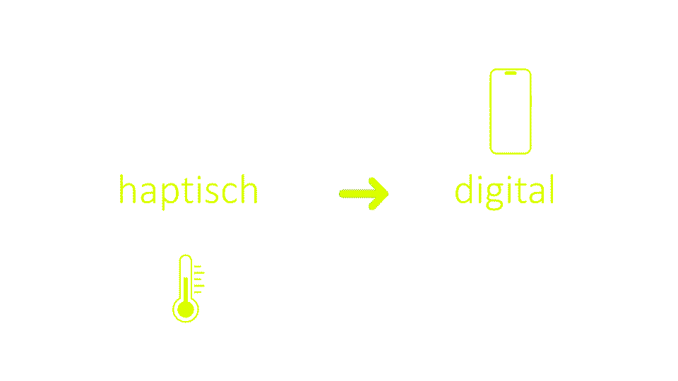

# Kap. 1: Intro Physische und digitale Welt

Dieses Kapitel gibt einen Einblick in die Relevanz von Web-Technologien, auch abseits des Webdesigns. Es folgt eine Einführung in Sensoren und Aktoren, die die physische und die digitale Welt miteinander verbinden. An Beispielen und Demos mngelt es nicht.

