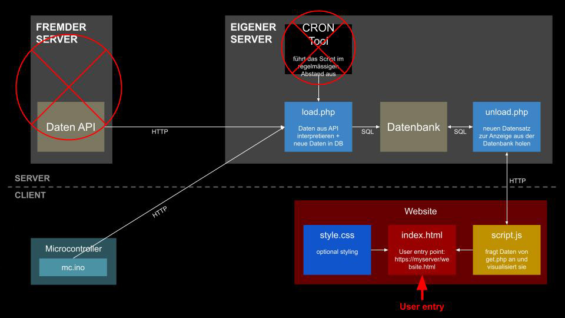

# Kap. 4: Rückblick und Ausblick

Während in früheren Semestern fremde Datenquellen für Datenanalyse und Datenvisualisierung genutzt wurden, wird im Beispielprojekt die fremde Datenquelle durch eigens erhobene Daten ersetzt. Es kann auf den bekannten Workflow aufgebaut werden.

