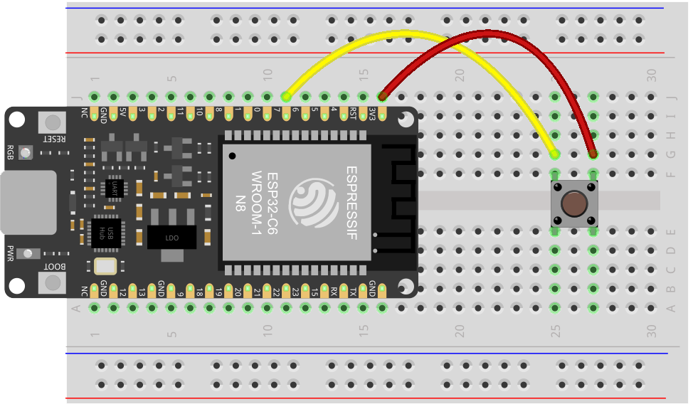

# Kap. 6: Logik per Microcontroller

[Videokurs: 06_Logik per Microcontroller](https://youtu.be/TRqyVxJVdrs?si=asa4xV4VXf-ZDZqz)

Elektronische Schaltungen können unendlich komplex werden. Wir können Logik in Form von elektronischen Schaltungen abbilden. Stattdessen lagern wir Logik für unsere interaktiven Gadgets auf Microcontroller aus. Der Microcontroller wird in den Schaltkreis integriert. Für die logik programmieren wir hauptsächlich.
Ein Microcontroller ist ein Computer mit Ein- und Ausgängen, der ein einziges Programm "abspielt”.

Dieser Steckplan zeigt, wie das Signal eines Tasters an einevm Eingangs-Pin des Microcontrollerboards anliegt. 