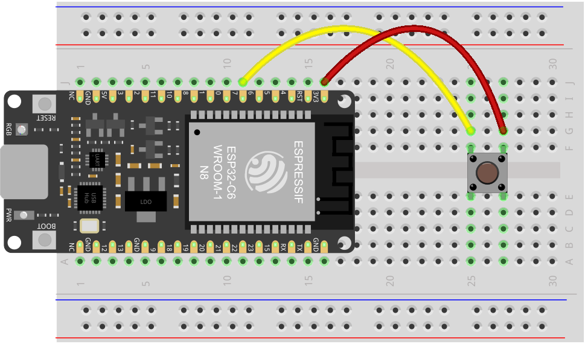

# Kap. 7: Serielle Kommunikation

[Videokurs: 07_Serielle Kommunikation](https://youtu.be/0p5VOeOSZ7o)

Nun soll der Microcontroller mit dem Computer sprechen. 
Zum Beispiel, damit wir mit Hilfe von Sensoren Computerprogramme steuern können.
Die einfachste Möglichkeit ist die serielle Kommunikation (per UART). 

Gleicher Steckplan wie in Kap. 6: Das Signal eines Tasters an einem Eingangs-Pin des Microcontrollerboards wird per serielle Kommunikation an einen Computer weitergereicht, um andere Programme zu steuern (z. B. Unity, Node.js, TouchDesigner, ...)