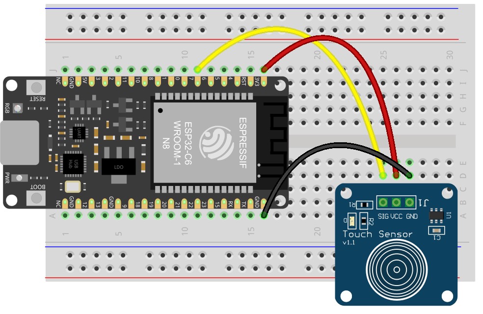
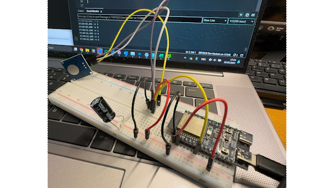

# Kap. 09: Sensoren testen
## 04: Touchsensor

 Empfange Sensor-Input von z. B. 

 * **Touchsensor**
 * PIR sensor
 * Touch-Sensor, 
 * Lichtsensor 
 
 und schreibe die Daten an den seriellen Port.

 Bauteil: [TTB223B](https://t1p.de/x0ivn)

 *Verbinde:*

| Sensor | ESP32-C6 |
| ------ | -------- |
| Vin    | 3.3V     |
| GND    | GND      |
| Data   | GPIO7    |

