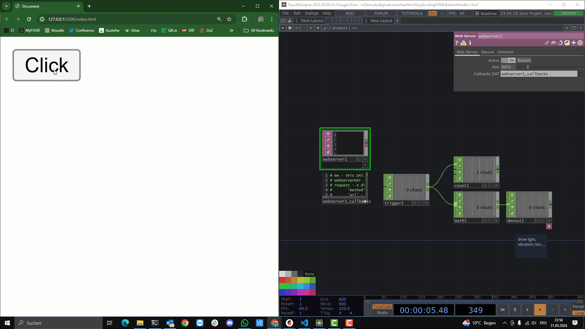

# Kap. 11: WLAN und Kommunikation via Internet
## Website ➜ LED (2-Dateien-Lösung)

Task: Sende den Status eines HTML-Buttons an den MC, um eine LED zu steuern

Hier ist kein Webserver erforderlich.
Man braucht eine Sender-Datei im Browser und eine Empfänger-Datei auf dem Microcontroller.
Wird der HTML-Button der Sender-Datei gedrückt, wird abwechselnd 1 oder 0 in einen JSON-Text geschrieben und im Body einer HTTP-Nachricht an den MC geschickt.
Dort wird der JSON-Text decodiert und der eigentliche Wert in einen Spannung übersetzt, womit die LED versorgt wird.

Versuche, den Code zu verstehen

1. Lade die Dateien `mc.ino` und `website.html` aus dem GitHub Repo 
2. Lade `mc.ino` mit der Arduino IDE auf den MC.
3. Verbinde dich mit dem Laptop mit demselben WLAN-Netzwerk wie der MC.
4. In der seriellen Schnittstelle wird die IP-Adresse des ESP32-C6 angezeigt. Evtl. ist es erforderlich, vorher den Reset Button am ESP32-C6 zu drücken.
5. In website.html muss die fetch()-Funktion auf die IP-Adresse des ESP32-C6 angepasst werden.
`fetch("http://<your_ip_addr>/postjson”`
6. Öffne website.html im Browser und drücke den Button.

