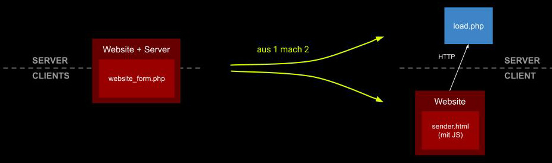
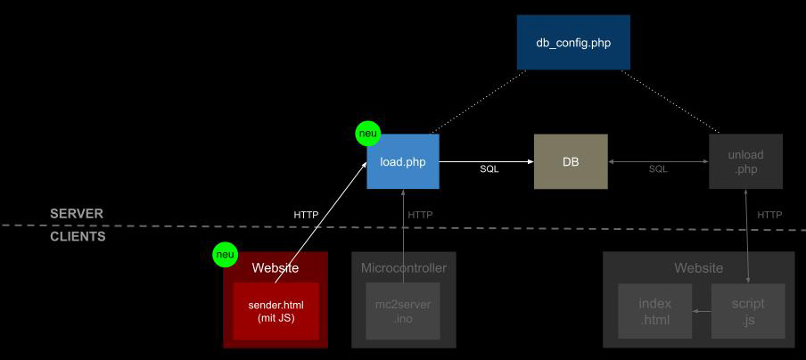

# Kap. 13: Website ➜ DB
## Schritt 3: HTML-Seite ➜ PHP ➜ DB

Wir trennen den Client-seitigen und den serverseitigen Teil voneinander. Der Client sendet nun eine HTTP-Nachricht an den Server - wie in einem Chat:
Der Client und der Server sprechen miteinander.

Wir splitten `website_form.php` in einen Client-seitigen Teil (`sender.html`) und einen serverseitigen Teil (`load.php`). 
`sender.html` wird (vergleichbar mit einem Chat) Nachrichten an `load.php` senden . Genauso wird es später auch mit dem Microcontroller passieren: Der Microcontroller, der ebenfalls ein Client ist, ersetzt dann die Website.

Dazu brauchen wir 2 Dateien, die im Live Coding selbst getippt werden:

* `sender.html`
* `load.php` 

Lade beide Dateien per FTP auf dein Online-Dateiverzeichnis auf Infomaniak (z. B. mit FileZilla).
Rufe den URL auf, über den `sender.html` erreichbar ist und gebe einige Werte ein 
Überprüfe via PHPmyAdmin, ob die Werte in die Datenbanktabelle geschrieben wurden.

