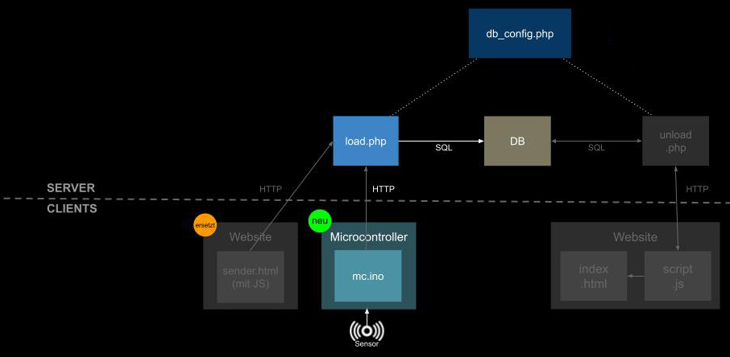

# Kap. 13: Microcontroller ➜ Datenbank

[Videokurs: 13_Moicrocontroller_to_DB](https://youtu.be/ZvpUM3ZEtJk)

Hier wird die Website `sender.html` (Formular) durch einen Microcontroller ersetzt.
Dieser sendet ebenfalls HTTP-Nachrichten. In diesem Beispiel sind sie identisch. Das bedeutet: Das serverseitige Empfänger-Script `load.php` muss daher nicht angepasst werden.

1. Lade die Datei `mc.ino` auf den ESP32-C6.
3. Überprüfe via PHPmyAdmin, ob die Werte in die Datenbanktabelle geschrieben wurden.
4. Erweitere das Schaubild entsprechend (Zwischenschritte fotografieren)
