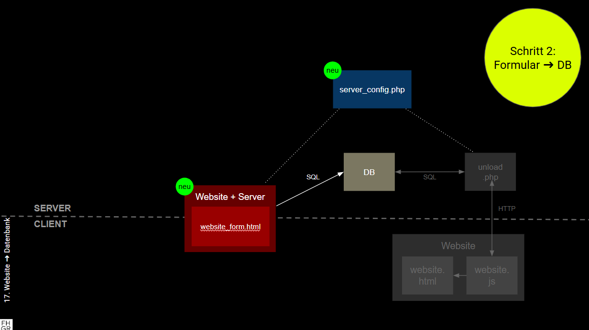

# Kap. 17: Website ➜ DB
## Schritt 2: Formular ➜ Datenbank

Wir erstellen zunächst ein Formular. 
Die Inhalte werden in eine Datenbanktabelle geschrieben, sobald es abgeschickt wird.
Dies ist innerhalb einer einzigen PHP-Datei möglich, die server-seitige und client-seitige Teile (HTML) enthält.

1. Lade von folgende Dateien herunter: 
   * `form2db.php`
   * `server_config.php_template` 
2. Verstehe den Code
3. Benenne die Datei `server_config.php_template` um zu `server_config.php`.
4. Gebe die Zugangsdaten zu deiner Datenbank ein in `server_config.php` und achte darauf, dass diese Datei nicht auf GitHub landet (!!!)
5. Lade beide Dateien per FTP auf dein Online-Dateiverzeichnis auf Infomaniak (z. B. mit FileZilla).
6. Rufe den URL auf, über den `form2db.php` (Web-Formular) erreichbar ist und gebe einige Werte ein 
7. Überprüfe via PHPmyAdmin, ob die Werte in die Datenbanktabelle geschrieben wurden.
