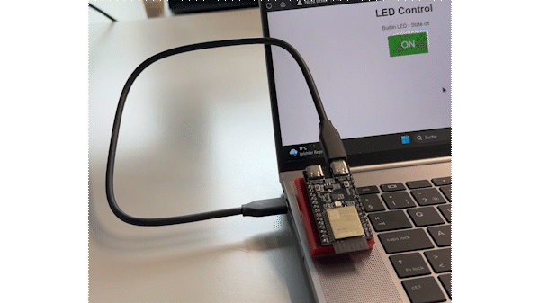

## Task 1: Einfacher Stromkreis

Wir bauen zunächst einen einfachen Stromkreis, der geschlossen wird, 
wenn ein Button gedrückt wird.

### Steckschema:

ersetze Button eg. durch Magnetsensor

## Task 2: Zeichne Signalverlauf ein.

## Task 3: ergänze Schaltung durch Microcontroller

Stecke folgende Schaltung, bei der mit einem Button reguliert wird, ob am Input eines Microcontrollerboards Spannung anliegt oder nicht. Diesen Impuls nutzen wir später in der Software als Trigger.

Steckschema:

## Task 4: Arduino IDE installieren

Was genau der Microcontroller macht, wenn z. B. Spannung an einem Input anliegt, legt das Programm fest, das wir auf ihn laden müssen.

Der Microcontroller erleichtert uns die Arbeit, indem wir nicht alle Aufgaben mit elektrischen Schaltungen lösen müssen.

Dazu installieren wir die Arduino IDE, 
mit der wir Programme für den Microcontroller entwickeln können und sie auf ihn laden können.
 
[Video Tutorial](https://youtu.be/mqFdqoG83SY )

## Task 5: Button-Input am Computer nutzen

[Arduino Code](../01_read_sensor/Button/Button.ino)
Steckschema bleibt gleich wie bei Task 3.

## Task 6: Button-Input ersetzen durch andere Sensoren

### Task 6a: Magnetsensor

Ersetze Button durch Reedschalter (Magnetsensor)

Steckschema:

Code ändert sich nicht.

### Task 6b: Touchsensor (TTB223B)

Steckschema:

Code ändert sich nicht.

### Task 6c: Lichtsensor(LM393)

Steckschema:

Code ändert sich nicht.

### Task 6d: Distanzsensor

Steckschema:

Code ändert sich nicht.

### Task 6e: Potentiometer

Steckschema:

[Arduino Code](../01_read_sensor/Poti/Poti.ino)

### Task 6f: Temperatursensor (DHT11)

Steckschema:

[Arduino Code](../01_read_sensor/Temperatursensor/Temperatursensor.ino)

Installiere `DHT sensor library` by `Adafruit` (Arduino IDE: `Tools / Manage libraries`)

### Task 6g: RFID Input (RC522)

Steckschema:

[Arduino Code](../01_read_sensor/RFID-Reader/RFID-Reader.ino)

Installiere `MFRC522v2 library` by `GithubCommunity`
(Arduino IDE: `Tools / Manage libraries`)

### Task 6h: Rotary Encoder (Endlos-Drehregler)

Steckschema:

[Arduino Code](../01_read_sensor/RotaryEncoder/RotaryEncoder.ino)

## Task 7: Aktoren

### Task 7a: LED schalten

Empfange Daten serielle Daten von einem Computer (1 oder 0) und steuere damit eine LED.

Die 1 oder 0 kann vom seriellen Monitor der Arduino IDE kommen (eintippen und enter) oder von einer anderen Software, die serielle Kommunikation unterstützt (z. B. TouchDesigner - unten rechts).

Steckschema:

[Arduino Code](../02_drive_actors/Switch_LED_Vibration/Switch_LED_Vibration.ino)

### Task 7b: Vibrationsmotor schalten

Empfange Daten serielle Daten von einem Computer (1 oder 0) und steuere damit einen Vibrationsmotor.
Achtung: funktioniert **nicht** mit 390Ω Vorwiderstand. Lass ihn weg.

Steckschema:

Code ändert sich nicht.

## Task 8: PWM Pulsweitenmodulation

### Task 8a: LED dimmen

Steckschema:

[Arduino Code](../02_drive_actors/Fade_LED/Fade_LED.ino)

### Task 8b: Servo (SG90) steuern

Steuere den Servo (SG90)  
Stecke die Schaltung und teste den Code.
Installiere ESP32Servo library by Kevin Harrington
(Arduino IDE: Tools / Manage libraries)

Steckschema:

[Arduino Code](../02_drive_actors/Drive_servo/Drive_servo.ino)

## Website2actor

### Task 11: Schalte LED per HTML-Button

* Lade den [Arduino-Code](../03_website2actor/01_website2led_simple/01_website2led_simple.ino) mit der Arduino IDE auf den MC.
* Verbinde dich mit dem Laptop vorübergehend mit demselben WLAN-Netzwerk wie der MC. Evtl. ist es erforderlich, den Reset Button am ESP32-C6 zu drücken.
* Gib im Browser am Laptop die IP-Adresse deines ESP32-C6 ein.
z. B.: `192.168.0.190`. Die individuelle IP Adresse wird im seriellen Monitor angezeigt, wenn am ESP32-C& der Reset Button gedrückt wird.
Ansonsten folge Troubleshooting Guide unten

Steckschema:

Keine Schaltung benötigt. Es wird nur die BUILTIN_LED verwendetx.

MC funktioniert hier als Webserver, der einen HTML-Code bereitstellt. Mit dem Browser rufen wir diese auf.
Achtung: funktioniert ohne Weiteres nur im lokalen WLAN-Netzwerk.
Ausweg: VPN, Port Forwarding, ...

### Task 12: Sende den Status eines HTML-Buttons an den MC, um eine LED zu steuern

Kein Webserver erforderlich.
Wird der HTML-Button gedrückt, wird abwechselnd 1 oder 0 in einen JSON-Text geschrieben und im Body einer HTTP-Nachricht an den MC geschickt.
Dort wird der JSON-Text decodiert und der eigentliche Wert in einen Spannung übersetzt, womit die LED versorgt wird.

### Exkurs: HTML-Button - to - TouchDesigner

Verbindung zu z. B. generativer Grafik, Veranstaltungstechnik, ML Modellen, ...
[TouchDesigner-Datei](03_website2actor/website2td.html)

### Task 13a: Anmelden bei Infomaniak Webhosting

Das IM-Team empfiehlt die Nutzung des Wobhosting Dienstes [Infomaniak](https://www.infomaniak.com/de/bildung).
Studierende können das Webhosting-Angebot 1 Jahr gratis nutzen. Der Domain ist kostenpflichtig.

## 04_website2db

Auf 04 wird in 05 und in 06 aufgebaut.

### Task 13b: Lege Datenbank-Tabelle an

In unserem Minimalbesispiel speichern wir immer nur einen Wert, den Sensorwert.
Zusätzlich erzeugen wir zwei weitere Tabellenspalten: id und Timestamp. Diese werden von der Datenbank automatisch ausgefüllt, sobald ein neuer Wert gespeichert wird. [SQL Command zur Erzeugung der Tabelle](../04_website2db/db_table.sql). Die Datenbanktabelle ändert sich in 05 und 06 nicht mehr.

### Task 15: Formular - to - DB
Die Datei [Formular - to - DB](../04_website2db/zz_IM3_website2server2db.php) zeigt den Weg von einem Formular über PHP in die Datenbak in einer einzigen Datei. Dies ist der übliche Fall. In Task 13b wird dieser Prozess allerdings auf zwei Dateien aufgeteilt, um die Kommmunikation von Website zur load.php Datei auf dem Server und dann auf die Datenbank zu demonstrieren. In 05_mc2db wird die Sender-Website mit Formular ersetzt durch einen Microcontroller, der mit demselben Datenübertragungsprotokoll (HTTP) Sensordaten an das Empfänger-PHP-Script load.php schickt.

