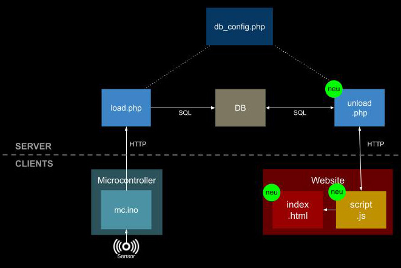

# Kap. 14: Microcontroller ➔ Dataviz

Nachdem die Sensordaten vom Microcontroller erfolgreich in eine Datenbanktabelle geschrieben wurden, geht es nun hier um Datenvisualisierung. Das ist grundsätzlich Wiederholung von früheren Semestern.
Wird `index.html` im Browser aufgerufen, wird `script.js` vom Server (`unload.php`) Daten anfragen, die unload.php in der Datenbank sucht und an `script.js` weiterreicht.

1. Hier kommen folgende Dateien hinzu:
   * `load.php`
   * `index.html`
   * `script.js`
   * (ggf. `style.css`) 

    `script.js` wird in `index.html` eingebunden.
    `script.js` fragt bei `unload.php` mit `fetch()`Daten an.
    `unload.php` tätigt eine Datenbankabfrage per SQL-Abfrage
    und analysiert sie ggf.
    `script.js` stellt die Daten (z. B. mit chart.js) dar.
    Wird `index.html` aufgerufen, ist die Datengrafik zu sehen.

2. Sammle Daten mit dem Sensor und frage die aktuelle Datengrafik ab, indem du `index.html` im Browser neu lädst.
3. Erweitere das Schaubild entsprechend 
