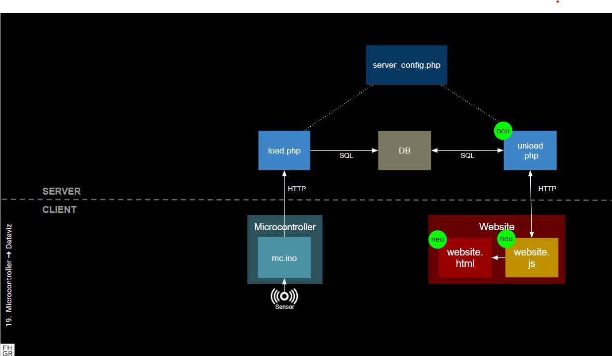

# Kap. 19: Microcontroller ➔ Dataviz

Hier geht es um Datenvisualisierung. Das ist grundsätzlich Wiederholung von IM2 und IM3.
Wird `website.html` im Browser aufgerufen, wird website.js vom Server (`unload.php`) Daten anfragen, die unload.php in der Datenbank sucht und an `website.js` weiterreicht.

1. Hier kommen folgende Dateien hinzu:
   * `load.php`
   * `website.html`
   * `website.js`
   * (ggf. `website.css`) 

    `website.js` wird in `website.html` eingebunden.
    `website.js` fragt bei `unload.php` mit `fetch()`Daten an.
    `unload.php` tätigt eine Datenbankabfrage per SQL-Abfrage
    und analysiert sie ggf.
    `website.js` stellt die Daten (z. B. mit chart.js) dar

2. Sammle Daten mit dem Sensor und frage die aktuelle Datengrafik ab, indem du `website.html` im Browser neu lädst.
3. Erweitere das Schaubild entsprechend 
