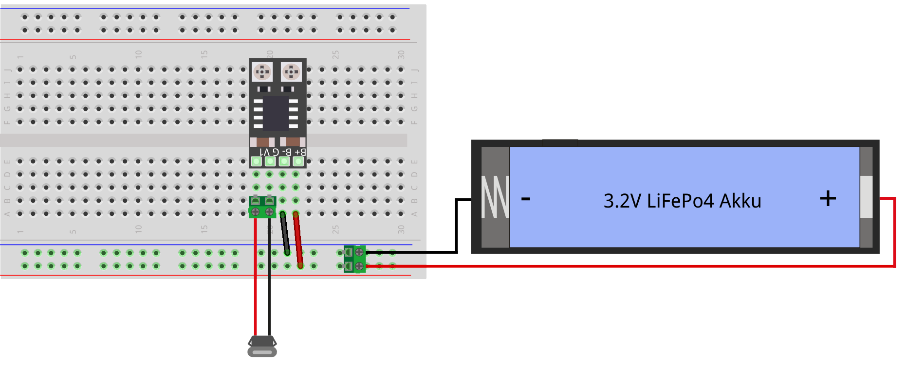
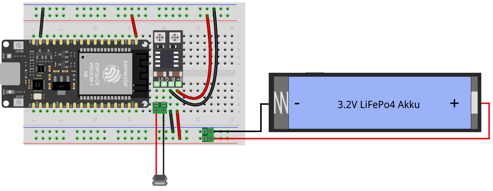
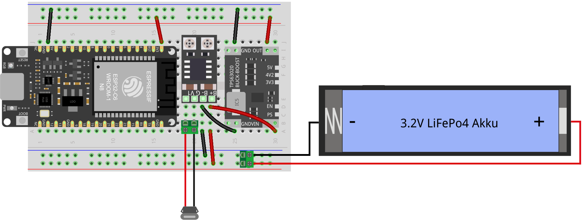

# Kap. 17: Batteriebetrieb

Wenn der Datenaustausch schon drahtlos erfolgt, ist es praktisch, wenn auch die Stromversorgung drahtlos ist.
Batterie-Optionen gibt es genügend.
Doch muss dafür der Microcontroller immer komplett an sein?
Eine Messstation liefert meistens nicht paermanent Daten. In den Wartezeiten kann der Microcontroller in den Deepsleep Modus versetzt werden. Energiehungrige Aktivitäten wie Bluietooth und WLAN werden dabei ausgeschaltet.
Das steigert die Akku-Dauer gewaltig.
Dieses Kapitel gibt eine praktische Einführung in den Deepsleep-Modus.

Anbei eine Anleitung zum Laden des Akkus:

Anbei eine Schaltung für's Laden bei gleichzeitigem Betrieb des Microcontrollers:

Anbei zusätzlich mit Spannungsregler auf 3.3V (ptimal für den ESP32-C6):
