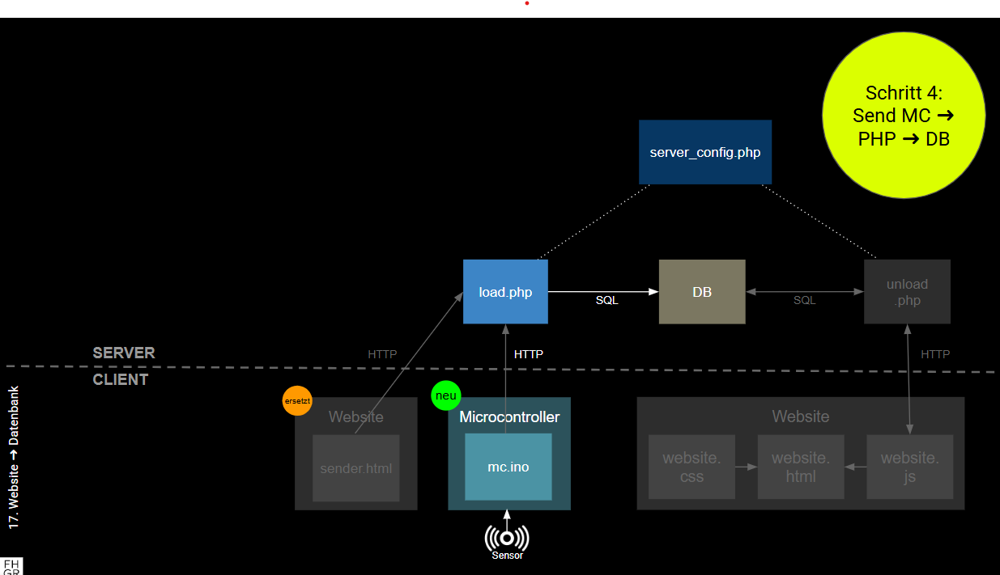

# Kap. 18: Microcontroller ➜ Datenbank

Hier wird die Website `sender.html` durch einen Microcontroller ersetzt.
Dieser sendet die gleichen HTTP-Nachrichten. Das serverseitige Empfänger-Script `load.php` muss daher nicht angepasst werden.

1. Lade die Datei `mc.ino` auf den ESP32-C6.
3. Überprüfe via PHPmyAdmin, ob die Werte in die Datenbanktabelle geschrieben wurden.
4. Erweitere das Schaubild entsprechend (Zwischenschritte fotografieren)
