# Installation Raspberry Pi OS

### 1. Vorbereitung

- Lade den Raspberry Pi Imager herunter
  [https://www.raspberrypi.com/software/](https://www.raspberrypi.com/software/)
- Verbinde Micro SD Karte mit dem Computer

### 2. Modell auswählen

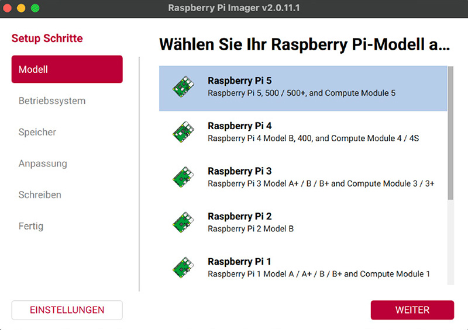

### 3. Betriebssystem auswählen

Wähle die 64-bit-Variante

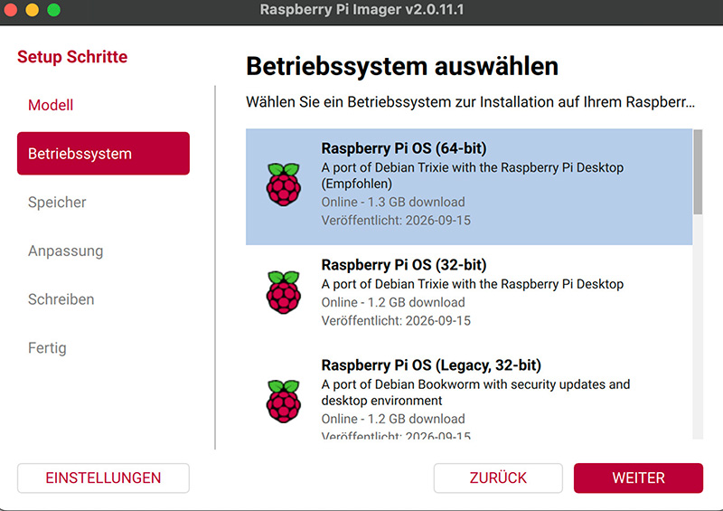

### 4. SD Karte auswählen

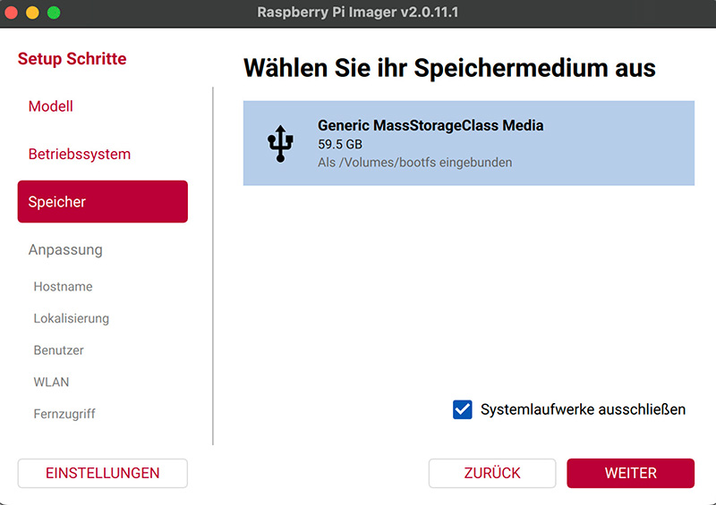

### 5. Hostname festlegen

Unter diesem Namen ist der Raspberry später im Netzwerk zu finden. Stattdessen kann zur Identifizierung auch die IP-Adresse verwendet werden.
_jan = z.B. 192.168.0.67_

Beachte: Im Hochschulnetzwerk _eduroam_ wird der Zugriff auf den Rapberry Pi per SSH verhindert.
Im Netzwerk _MMP_MediaApp_ im Medienhaus funktioniert der Zugriff über SSH zwar, aber statt Hostname muss bisher die IP-Adresse des Raspberry Pi angegeben werden. Diese kann über einen Netzwerkscanner herausgefunden werden -> siehe weiter unten.

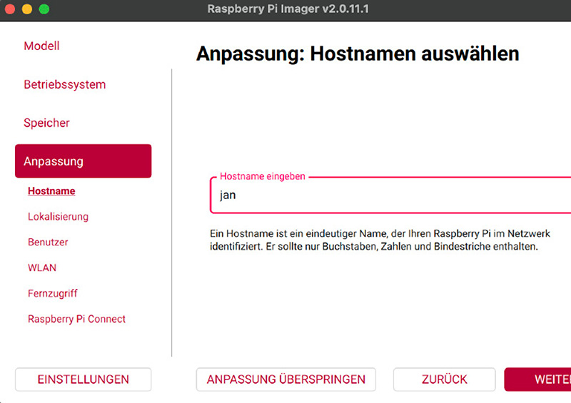

### 6. Lokalisierung

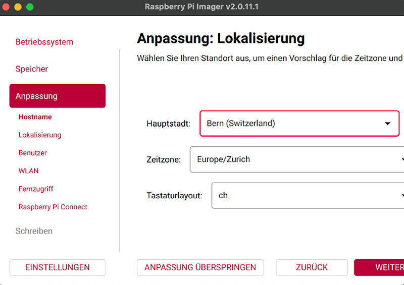

### 7. Benutzername / Passwort festlegen

Nimm für den Anfang bitte...

- Benutzername: **pi**
- Passwort: **raspberry**

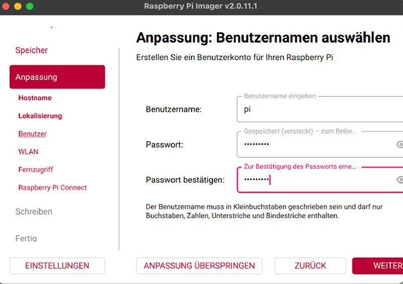

### 8. WLAN-Verbindung speichern

Dieser Schritt ermöglicht uns, von Anfang an remote auf den Raspberry Pi zugreifen zu können. Er meldet sich automatisch im WLAN-Netzwerk an und man muss nicht erst mühsam Display, Maus und Tastatur anschliessen, um dies zu tun.

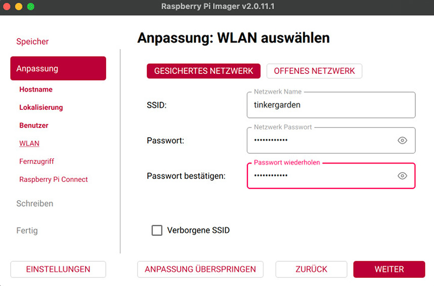

### 9. Authentifizierung via SSH aktivieren

Dies ist nötig, damit man später remnote von einem Computer mit Tastur, Maus und Display auf dem Raspberry Pi arbeiten kann, ohne dass man ihm ebenfalls Tastur, Maus und Display geben muss.

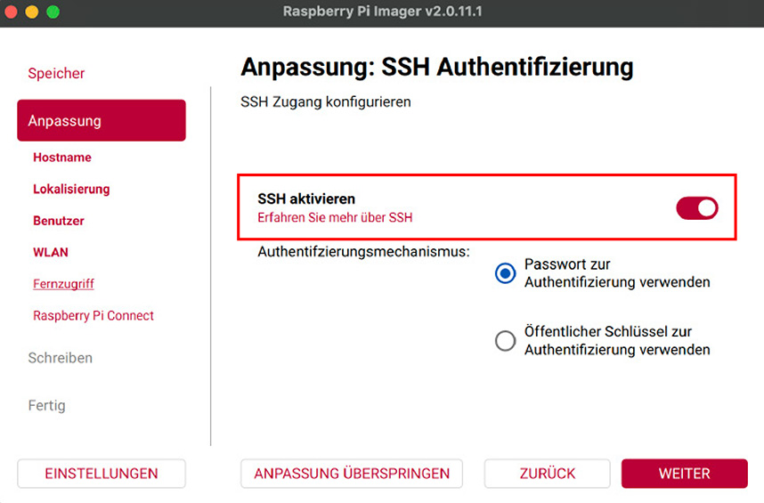

### 10. Screen Share

Mit Raspberry Pi Connect kann man sich online von einem beliebigen Computer, auch ausserhalb des Heimnetzwerks, mit dem Rpi verbinden. Besonders interessant ist der Strem des grafischen Displays.

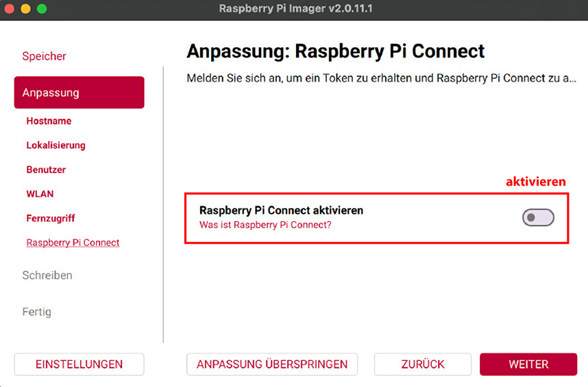

Aktiviere.

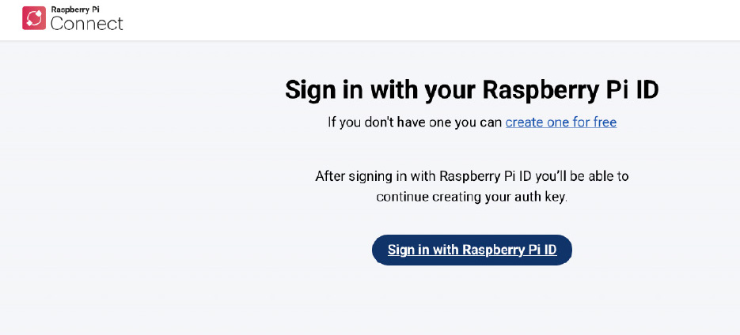

Sobald man zum Installationsagenten zurück geleitet wird, wird der Verbindungstoken automatisch eingetragen.

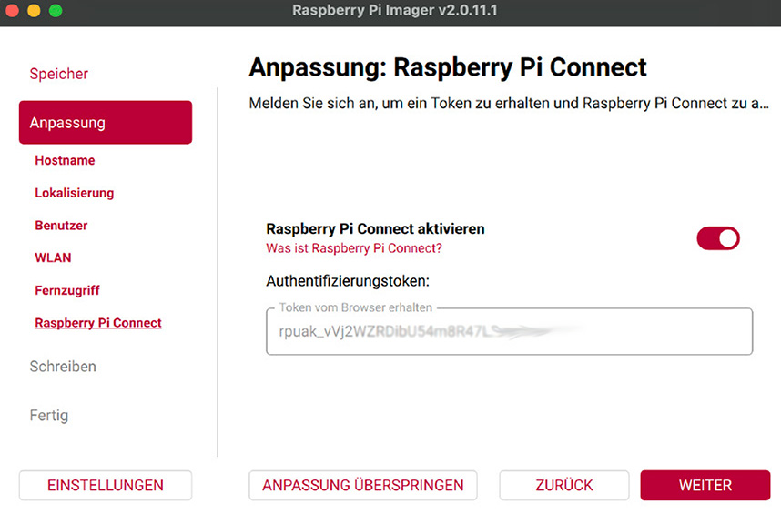

### 11. Betriebssystem auf die SD Karte laden

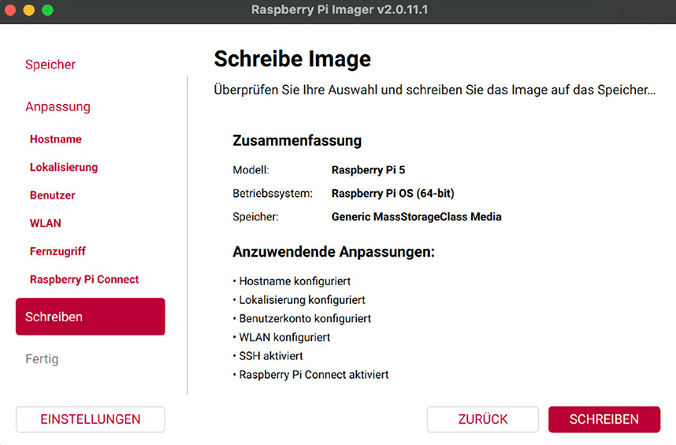

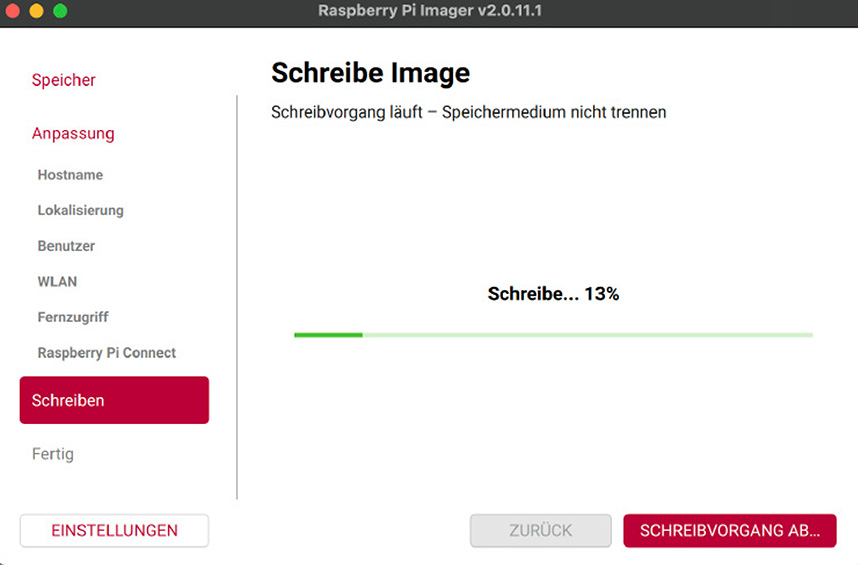

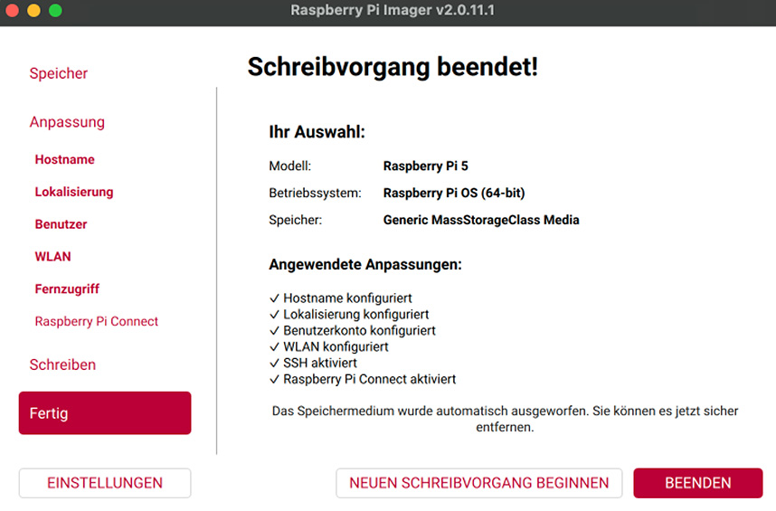

### 12. Inbetriebnahme

- Stecke die frische Micro SD Karte in den Rpi
- Gib ihm Strom (Achtung: 5A-Netzteil nötig)
- Rpi fährt automatisch hoch - warte paar Minuten

### 13. Verbinde mit GUI

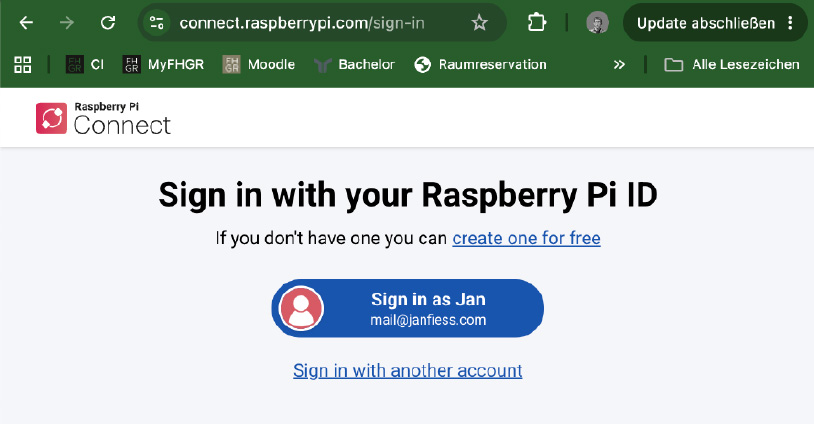

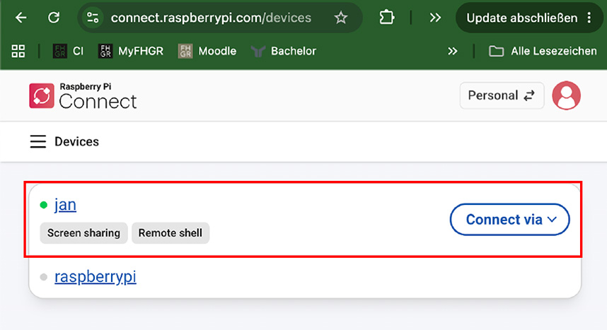

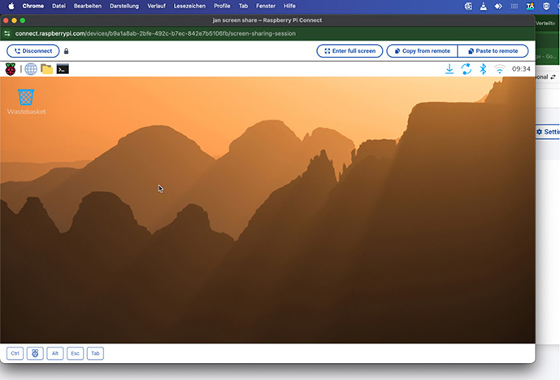

- Terminal öffnen

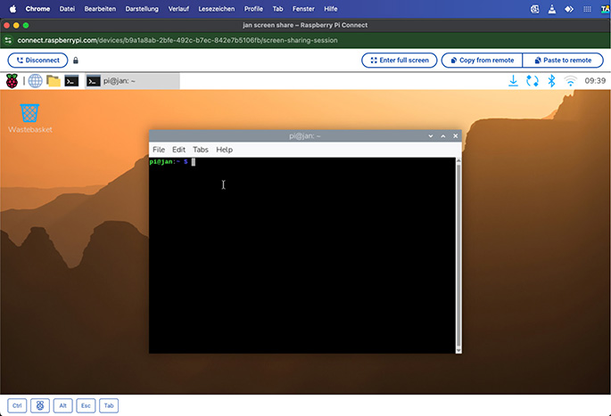

### 14. Remote-Zugriff per SSH

- In diesem Guide müssen dein Arbeitscomputer und der Rpi im selben Netzwerk sein.

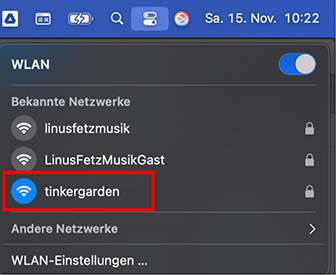

- Öffne _Terminal_ am Mac oder _CMD_ bei Windows bzw. nutze den eingebauten Terminal einer IDE, z.B. in _VS Code_.

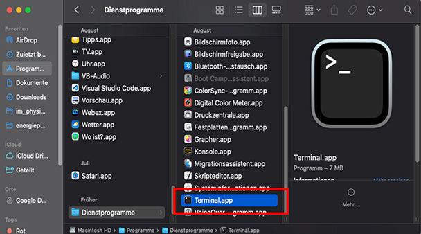

- mit dem Rpi verbinden:

```
ssh [username]@[hostname]
```

Beispiel:

```
ssh pi@jan
```

Falls das Netzwerk keine hostnames akzeptiert, brauchst du die IP Adresse des Rpi. Diese lässt sich komfortabel z.B. über eine Netzwerkscanner-App herausfinden, wie z.B _iNet_.

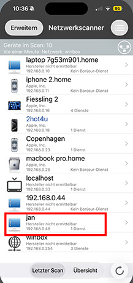

In diesem Fall funktioniert die Anmeldung per SSH wie folgt:

```
ssh [username]@[ip address]
```

Beispiel:

```
ssh pi@192.168.0.67
```

- Danach alles mit "yes" akzeptieren
- Passwort eingeben

Dann kannst du von remote mit dem Rpi arbeiten.
