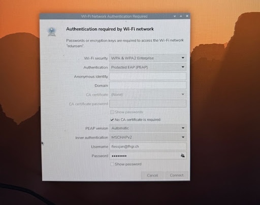

# Installation IoT-Stack am Raspberry Pi

Ein “IoT-Stack” ist eine Sammlung mehrerer Programme (= “Dienste” \= "Microservices"), die für eine IoT-Applikation sehr nützlich sind.  
Sie arbeiten autonom und werden je nach Use Case miteinander verbunden.

Die Bandbreite an Microservices ist riesig:  
Beispiele: Datenbanken, Visualisierungs-Tools, Programmierumgebungen, Smart Home-Applikationen, Kommunikationsknoten, Medienserver, …

Diese Anleitung führt dich Schritt für Schritt durch den Installationsprozess einiger wichtiger Microservices.

# 1. Per SSH mit einem Server (Rpi) verbinden

Verbindung vom Laptop zum Server herstellen  
In diesem Abschnitt werden drei Möglichkeiten vorgestellt. Wähle eine davon aus:

- 1.1. Raspberry Pi

Egal ob Raspberry Pi oder ein Hosting-Anbieter (wie Infomaniak VPS oder Hetzner): es handelt sich jeweils um einen entfernten Computer (“Server”), auf den man sich zuerst einloggen muss, bevor man darauf arbeiten kann.  
_Oder hast du etwa Zugriff auf ein fremdes Haus, wenn du keinen Schlüssel dafür hast?_

## 1.1. SSH-Verbindung per Raspberry Pi herstellen

Der Raspberry Pi bootet von einer MicroSD Karte. Um das Betriebssystem _Raspberry Pi OS_ auf eine SD Karte zu installieren, ist es ratsam, den Raspberry Pi Imager zu verwenden:  
[https://www.raspberrypi.com/software/](https://www.raspberrypi.com/software/)  
Eine ausführliche Anleitung zur Konfiguration des Betriebssystems befindet sich in einer separaten Anleitung.

Wichtig:

- Betriebssystem: Raspberry Pi OS 64 Bit
- Username und Passwort für den Raspberry Pi festlegen (z. B. Username: pi, Passwort: raspberry)
- WLAN: Username und Passwort angeben
- Erweitert: SSH aktivieren

Nachdem das Betriebssystem auf die SD Karte installiert wurde, in den Raspberry gesteckt wurde und dieser per Stromzufuhr gestartet ist, stelle zunächst sicher, dass dein lokaler Computer im selben Netzwerk ist. Danach öffne den Terminal (Mac) bzw. VS Code Console (Windows und Mac) oder Putty (Windows) und melde dich mit deinem Computer beim Raspberry Pi an.

```
ssh [username]@[hostname]
```

zum Beispiel:

```
ssh pi@janpi
```

Anstatt Hpstname kann auch die IP Adresse des Rpi angegeben werden:

```
ssh [username]@[ip_address]
```

zum Beispiel:

```
ssh pi@192.168.0.67
```

Es erfolgt eine Passwortabfrage.

### 1.1.1. Verbinde den Raspberry Pi mit dem Hochschulnetzwerk

Idealerweise verwendest du ein Heimnetzwerk mit SSID und Passwort
Für ein WPA2-Enterprise-verschlüsseltes Netzwerk reicht ein Login via SSID und Paswort nicht aus.  
Die FHGR stellt u. a. diese Netzwerke zur Verfügung:

- eduroam  
  (begrenzte Kommunikationsmöglichkeiten an der FHGR, zB SSH funktioniert nicht)
- **MMP_MediaApp** (empfohlen)  
  (mehr Kommunikationsmöglichkeiten, es muss aber aktiv gesucht werden, weil es sich um ein verstecktes Netzwerk handelt)



# 2\. Programme installieren

In dieser Anleitung werden die Microservices per `docker-compose` standardisiert installiert. Hier werden direkt mehrere Dienste zur Verwendung im Bereich IoT mit installiert. Mit docker-compose sind die Installation und der Betrieb komfortabler.

Folgende Microservices werden hier per docker-compose installiert:

- nodered (node-basierte serverseitige JavaScript-Entwicklungsumgebung)
- mosquitto (MQTT Kommunikationszentrale \= “Broker”)
- mariadb (SQL-Datenbank)
- adminer (grafisches Interface für die Datenbank, vgl. PHPMyAdmin)
- influxdb (Time-Series-Datenbank)
- grafana (Datenvisualisierungs-Tool \= “Chart.js” in einfach)
- wordpress (Website mit CMS, ist immer gut zu haben)
- portainer (Übersicht über die Aktivität aller hier aufgeführten Container \~Dienste)

Vergewissere dich, dass du im Home-Verzeichnis bist:

```
cd ~
```

Erstelle eine Installationsdatei `setup.sh`

```
sudo nano setup.sh
```

und kopiere folgenden Inhalt hinein.  
Dieses Script sollte für Raspberry Pi, wie auch für Hosting-Anbieter wie Infomaniak VPS und Hetzner, funktionieren.

## 2.1. Installationsscript

```bash
#!/bin/bash
set -e

# ==============================
# Allgemeine Variablen
# ==============================
HOME_DIR="$HOME"
STACK_DIR="$HOME_DIR/iot-stack"
USER_NAME="admin"
USER_PASS="strenggeheim"
GRAFANA_UID=472
INFLUXDB_UID=999
OS_USERNAME=$USER

echo "============================================"
echo "🎯 START: IoT Stack Setup"
echo "Stack-Verzeichnis: $STACK_DIR"
echo "Benutzer: $OS_USERNAME"
echo "============================================"

sudo mkdir -p "$STACK_DIR"
sudo chown -R "$OS_USERNAME":"$OS_USERNAME" "$STACK_DIR"

# ==============================
# Node.js + npm Installation
# ==============================
if ! command -v node >/dev/null 2>&1 || ! command -v npm >/dev/null 2>&1; then
    echo "📦 Node.js oder npm nicht gefunden – Installation..."
    sudo apt-get update -y
    DEBIAN_FRONTEND=noninteractive sudo apt-get install -y curl gnupg lsb-release build-essential
    curl -fsSL https://deb.nodesource.com/setup_20.x | sudo bash -
    DEBIAN_FRONTEND=noninteractive sudo apt-get install -y nodejs
else
    echo "✅ Node.js und npm sind bereits installiert."
fi

# ==============================
# Systemupdate + Python3
# ==============================
echo "🔄 Systempakete aktualisieren..."
sudo apt-get update -y
DEBIAN_FRONTEND=noninteractive sudo apt-get upgrade -y
sudo apt-get install -y ca-certificates curl gnupg lsb-release python3 python3-pip

# ==============================
# Docker Installation
# ==============================
echo "🐳 Docker installieren..."
TMP_DOCKER_SCRIPT=$(mktemp)
curl -fsSL https://get.docker.com -o "$TMP_DOCKER_SCRIPT"
sudo sh "$TMP_DOCKER_SCRIPT"
sudo rm -f "$TMP_DOCKER_SCRIPT"
sudo apt-get install -y docker-compose-plugin
sudo systemctl enable docker
sudo systemctl start docker

# ==============================
# Mosquitto Konfiguration
# ==============================
echo "🔑 Mosquitto Passwort generieren..."
MOSQ_DIR="$STACK_DIR/mosquitto"
sudo mkdir -p "$MOSQ_DIR/data" "$MOSQ_DIR/log" "$MOSQ_DIR/config"
sudo docker run --rm -i -v "$MOSQ_DIR/config:/mosquitto/config" eclipse-mosquitto mosquitto_passwd -c -b /mosquitto/config/mosquitto.passwd "$USER_NAME" "$USER_PASS"
sudo chmod 600 "$MOSQ_DIR/config/mosquitto.passwd"
sudo chown root:root "$MOSQ_DIR/config/mosquitto.passwd"

sudo tee "$MOSQ_DIR/config/mosquitto.conf" >/dev/null <<EOF
allow_anonymous true
password_file /mosquitto/config/mosquitto.passwd
listener 1883 0.0.0.0
persistence true
persistence_location /mosquitto/data/
log_dest file /mosquitto/log/mosquitto.log
EOF

# ==============================
# Volume Berechtigungen
# ==============================
echo "🔑 Berechtigungen für InfluxDB und Grafana Volumes setzen..."
sudo mkdir -p "$STACK_DIR/influxdb"
sudo chown -R $INFLUXDB_UID:$INFLUXDB_UID "$STACK_DIR/influxdb"
sudo mkdir -p "$STACK_DIR/grafana"
sudo chown -R $GRAFANA_UID:$GRAFANA_UID "$STACK_DIR/grafana"
sudo mkdir -p "$STACK_DIR/mariadb"
sudo mkdir -p "$STACK_DIR/wordpress"

# ==============================
# Node-RED Konfiguration
# ==============================
echo "🧩 Node-RED Konfiguration..."
NODERED_DIR="$STACK_DIR/nodered"
SETTINGS_FILE="$NODERED_DIR/settings.js"
sudo mkdir -p "$NODERED_DIR"

if [ ! -f "$NODERED_DIR/flows.json" ]; then
    echo '[]' | sudo tee "$NODERED_DIR/flows.json" >/dev/null
    sudo chown 1000:1000 "$NODERED_DIR/flows.json"
fi

TMP_NODE_DIR=$(mktemp -d)
cd "$TMP_NODE_DIR"
npm init -y >/dev/null
npm install bcryptjs >/dev/null
HASH=$(node -e "const bcrypt = require('bcryptjs'); bcrypt.hash('$USER_PASS', 12, (err, hash) => { if(err){console.error(err); process.exit(1);} console.log(hash); })")
cd -
rm -rf "$TMP_NODE_DIR"

sudo tee "$SETTINGS_FILE" >/dev/null <<EOF
module.exports = {
    editorTheme: { theme: "dark", projects: { enabled: true } },
    adminAuth: { type: "credentials", users: [{ username: "${USER_NAME}", password: "${HASH}", permissions: "*" }] },
    flowFile: 'flows.json',
    ui: { path: "ui" }
}
EOF
sudo chown -R 1000:1000 "$NODERED_DIR"

# ==============================
# docker-compose.yml erstellen
# ==============================
DOCKER_COMPOSE_FILE="$STACK_DIR/docker-compose.yml"
sudo tee "$DOCKER_COMPOSE_FILE" >/dev/null <<EOF
version: '3.9'

services:
  nodered:
    image: nodered/node-red:latest
    container_name: nodered
    restart: always
    ports:
      - "1880:1880"
    volumes:
      - ./nodered:/data
      - ./nodered/settings.js:/data/settings.js
    user: "1000:1000"
    depends_on:
      - mosquitto
    networks:
      - iot-net

  portainer:
    image: portainer/portainer-ce:lts
    container_name: portainer
    restart: always
    ports:
      - "9000:9000"
      - "9443:9443"
    volumes:
      - /var/run/docker.sock:/var/run/docker.sock
      - portainer_data:/data

  mosquitto:
    image: eclipse-mosquitto:latest
    container_name: mosquitto-server
    restart: always
    ports:
      - "1883:1883"
      - "9001:9001"
    volumes:
      - ./mosquitto/config/mosquitto.conf:/mosquitto/config/mosquitto.conf
      - ./mosquitto/config/mosquitto.passwd:/mosquitto/config/mosquitto.passwd
      - ./mosquitto/data:/mosquitto/data
      - ./mosquitto/log:/mosquitto/log
    networks:
      - iot-net

  influxdb:
    image: influxdb:latest
    container_name: influxdb
    restart: always
    ports:
      - "8086:8086"
    environment:
      DOCKER_INFLUXDB_INIT_USERNAME: admin
      DOCKER_INFLUXDB_INIT_PASSWORD: strenggeheim
      DOCKER_INFLUXDB_INIT_ORG: iot
      DOCKER_INFLUXDB_INIT_BUCKET: nodered
      DOCKER_INFLUXDB_INIT_MODE: setup
    volumes:
      - ./influxdb:/var/lib/influxdb2
    networks:
      - iot-net

  grafana:
    image: grafana/grafana:latest
    container_name: grafana
    restart: always
    ports:
      - "3000:3000"
    environment:
      GF_SECURITY_ADMIN_USER: admin
      GF_SECURITY_ADMIN_PASSWORD: strenggeheim
    volumes:
      - ./grafana:/var/lib/grafana
    networks:
      - iot-net

  mariadb:
    image: mariadb:latest
    container_name: mariadb
    restart: always
    environment:
      MYSQL_ROOT_PASSWORD: strenggeheim
      MYSQL_DATABASE: wordpress
    ports:
      - "3306:3306"
    volumes:
      - ./mariadb:/var/lib/mysql
    networks:
      - iot-net

  adminer:
    image: adminer:latest
    container_name: adminer
    restart: always
    ports:
      - "8080:8080"
    networks:
      - iot-net

  wordpress:
    image: wordpress:latest
    container_name: wordpress
    restart: always
    depends_on:
      - mariadb
    ports:
      - "80:80"
    networks:
      - iot-net
    environment:
      WORDPRESS_DB_HOST: mariadb
      WORDPRESS_DB_USER: root
      WORDPRESS_DB_PASSWORD: strenggeheim
      WORDPRESS_DB_NAME: wordpress
    volumes:
      - ./wordpress:/var/www/html

volumes:
  portainer_data:

networks:
  iot-net:
    driver: bridge
EOF

# ==============================
# Docker-Container starten
# ==============================
echo "🚀 Starte IoT-Stack Container..."
cd "$STACK_DIR"
sudo docker compose pull
sudo docker compose up -d

echo ""
echo "============================================"
echo "IoT Stack Setup abgeschlossen!"
echo "Alle Microservices laufen."
echo "Zugriff:"
echo "Portainer: 9000"
echo "Node-RED: 1880"
echo "Mosquitto: 1883"
echo "Grafana: 3000"
echo "MariaDB: 3306"
echo "Adminer: 8080"
echo "InfluxDB: 8086"
echo "WordPress: 80"
echo "============================================"
```

- Speichere die Datei: `CTRL + o`
- Bestätige dies und verlasse die Datei: `CTRL + x`.
- Mach die Datei ausführbar

```
sudo chmod +x ./setup.sh
```

- Führe die Installationsdatei aus:

```
sudo ./setup.sh
```

## 2.2. Deinstallationsskript

Gib das Installationsscript in den KI-Chatbot deines Vertrauens und lass dir ein Script, das alle Installationsschritte rückgängig macht, sodass du wieder ein blankes System hast.  
Beim Raspberry Pi ist die sicherste Möglichkeit, ein frisches Betriebssystem auf eine SD Karte zu schreiben. Bei Cloud-Diensten lässt sich das Dateiverzeichnis i.d.R. nicht komplett resetten. Dort ist ein Deinstallationsscript hilfreich.  
Beispiel:

```
sudo nano deinstall.sh
```

Inhalt:

```bash
#!/bin/bash
set -e

# ==============================
# Allgemeine Variablen
# ==============================
HOME_DIR="$HOME"
STACK_DIR="$HOME_DIR/iot-stack"

echo "============================================"
echo "💥 START: IoT Stack Deinstallation"
echo "Stack-Verzeichnis: $STACK_DIR"
echo "============================================"

## 1. Docker Container, Volumes und Netzwerke entfernen
## ---------------------------------------------------
echo "🐳 Stoppe und entferne alle Docker Container, Volumes und Netzwerke..."
if [ -d "$STACK_DIR" ]; then
    cd "$STACK_DIR"
    # Container stoppen und entfernen, inklusive Netzwerken und benannten Volumes (portainer_data)
    sudo docker compose down -v
    cd "$HOME_DIR"
else
    echo "⚠️ Stack-Verzeichnis $STACK_DIR nicht gefunden. Überspringe Docker Compose down."
fi

## 2. Installationsverzeichnis löschen
## -----------------------------------
echo "🗑️ Lösche das gesamte Stack-Verzeichnis $STACK_DIR (inklusive aller Daten)..."
sudo rm -rf "$STACK_DIR"

## 3. Docker deinstallieren
## -----------------------
echo "❌ Deinstalliere Docker..."
sudo systemctl stop docker
sudo apt-get purge -y docker-ce docker-ce-cli containerd.io docker-buildx-plugin docker-compose-plugin
sudo rm -rf /var/lib/docker
sudo rm -rf /var/lib/containerd

## 4. Node.js und dazugehörige Pakete deinstallieren
## ------------------------------------------------
echo "❌ Deinstalliere Node.js, npm und build-essential..."
# Deinstalliere Node.js und das Paket, das bcryptjs zum Hashen benötigt
sudo apt-get purge -y nodejs build-essential

# Entferne das NodeSource Repository
if [ -f /etc/apt/sources.list.d/nodesource.list ]; then
    echo "🗑️ Entferne NodeSource Repository..."
    sudo rm /etc/apt/sources.list.d/nodesource.list
    sudo apt-get update -y
fi

## 5. Sonstige Pakete deinstallieren
## --------------------------------
echo "❌ Entferne sonstige installierte Pakete..."
# Da Python3 oft ein Systembestandteil ist, entfernen wir nur die nachinstallierten Pakete.
sudo apt-get purge -y python3-pip

## 6. Cleanup
## ----------
echo "🧹 System-Cleanup..."
# Entferne nicht mehr benötigte Abhängigkeiten
sudo apt-get autoremove -y
# Lösche heruntergeladene Installationsdateien
sudo apt-get clean

echo ""
echo "============================================"
echo "✅ DEINSTALLATION ABGESCHLOSSEN!"
echo "Dein System ist weitestgehend in den Ursprungszustand zurückgesetzt."
echo "Ein Neustart wird empfohlen."
echo "============================================"
```

Deinstallationsdatei ausführbar machen:

```
sudo chmod +x deinstall.sh
```

Deinstallationsdatei ausführen:

```
sudo ./deinstall.sh
```

# 3. Usage

Die meisten der installierten Dienste (= Microservices) haben grafische UIs, die über die jeweiligen Ports verfügbar sind.
Die Microservices sind passwortgeschützt.  
Derzeit ist der Zugang wie folgt:  
Ausser bei MariaDB ist die Wahl von Username und Passwort frei möglich.

| Dienst                    | Adresse                                                                      | Username             | Passwort     |
| :------------------------ | :--------------------------------------------------------------------------- | :------------------- | :----------- |
| Node-Red                  | `http://[ip]:1880`, z.B. `http://192.168.0.67:1880` oder `http://janpi:1880` | admin                | strenggeheim |
| Wordpress                 | `http://[ip]:80`                                                             | admin                | strenggeheim |
| Mosquitto (no GUI)        | `http://[ip]:1883`                                                           | admin                | strenggeheim |
| MariaDB (Adminer als GUI) | `http://[ip]:3306`                                                           | root                 | strenggeheim |
| Adminer (GUI für MariaDB) | `http://[ip]:8080`                                                           | root, Server:mariadb | strenggeheim |
| InfluxDB                  | `http://[ip]:8086`                                                           | admin                | strenggeheim |
| Grafana                   | `http://[ip]:3000`                                                           | admin                | strenggeheim |
| Portainer (Docker-GUI)    | `http://[ip]:9000`                                                           | admin                | strenggeheim |

# 5\. Free Online MQTT Brokers:

Zwar enthält die Installation einen Mosquitto MQTT Broker, manchmal macht es allerdings Sinn, zum Troubleshooting auf freie Online-Broker auszuweichen:

- [broker.emqx.io](http://broker.emqx.io)
- [test.mosquitto.org](http://test.mosquitto.org)
- [broker.hivemq.com](http://broker.hivemq.com)
- [public.mqttserver.eu](http://public.mqttserver.eu)
- [broker.mqtt-dashboard.com](http://broker.mqtt-dashboard.com)
