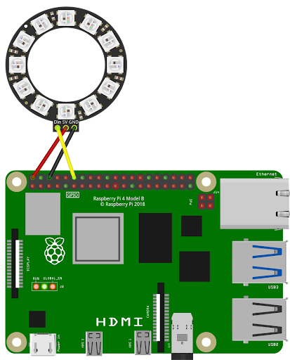
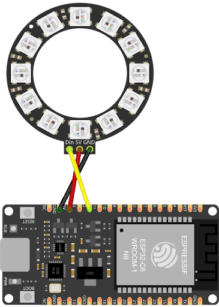

# LED Ring ansteuern

## 1. Am Raspberry Pi 5

### 1.1. Schaltung stecken

Für einen langlebigen Gebrauch wird ein Vorwiderstand und eine externe Stromversorgung am LED-Ring dringend empfohlen. Der Einfachheit halber wird hier darauf verzichtet.



### 1.2. Software-Konfiguration

#### 1.2.1. Vorbereitung

- Nötige Packages nachinstallieren:

```
sudo apt-get update
sudo apt-get upgrade
```

- Stelle sicher, dass du im Home-Verzeichnis bist:

```
cd ~
```

- Projekt-Verzeichnis erstellen:

```
mkdir ~/led-ring
```

- Ins Verzeichnis hineingehen:

```
cd ~/led-ring
```

#### 1.2.2. SPI aktivieren

```
sudo raspi-config
```

- Wähle `3 Interfacing Options`. -> `P4 SPI` -> `Yes`.
- Starte den Raspberry Pi neu:

```
sudo reboot
```

#### 1.2.3. Python-Library installieren

Bei Debian “Trixie” lassen sich keine Python Libraries mehr direkt installieren. Eine virtuelle Umgebung ist erforderlich.

- Stelle sicher, dass du im Projektverzeichnis bist::

```
cd ~/led-ring
```

- Erstelle die virtuelle Umgebung (z.B. mit dem Namen 'venv'):

```
python -m venv venv --system-site-packages
```

- Aktivieren die Umgebung zur Installation:

```
source venv/bin/activate
```

(Noch **nicht** tun: Virtuelle Umgebung wieder verlassen: `deactivate` )

- Python-Library installieren (endlich…):

```
pip install rpi5-ws2812
```

#### 1.2.4. Python Script erstellen

- Stelle sicher, dass du im Projektverzeichnis bist:

```
cd ~/led-ring
```

- Erstelle eine neue Python-Datei und öffne sie im Texteditor nano:

```
sudo nano led-ring.py
```

- Füge folgenden Inhalt ein:

```python

from rpi5_ws2812.ws2812 import Color, WS2812SpiDriver
import time

# Initialize the WS2812 strip with 100 leds and SPI channel 0, CE0
strip = WS2812SpiDriver(spi_bus=0, spi_device=0, led_count=100).get_strip()
while True:
  strip.set_all_pixels(Color(255, 0, 0))
  strip.show()
  time.sleep(2)
  strip.set_all_pixels(Color(0, 255, 0))
  strip.show()
  time.sleep(2)
```

- danach speichern (`CTRL + o`) und Texteditor verlassen (`CTRL + x`).

#### 1.2.5. Python Script starten

- Stelle sicher, dass du im Projektverzeichnis bist:

```
cd ~/led-ring
```

- Python-Programm ausführen:

```
python led-ring.py
```

- Script stoppen:

```
CTRL + C
```

#### 1.2.6. Autostart aktivieren

- Service-Datei erstellen und Texteditor nano öffnen:

```
sudo nano /etc/systemd/system/led-ring.service
```

- Folgenden Text hineinkopieren, danach speichern (CTRL + o) und Texteditor verlassen (CTRL + x)

```bash
[Unit]
Description=LED Ring Steuerung
After=network.target
[Service]
ExecStartPre=/bin/sleep 20
ExecStart=/home/pi/led-ring/venv/bin/python /home/pi/led-ring/led-ring.py
User=root
WorkingDirectory=/home/pi/led-ring
Restart=always
StandardOutput=journal
StandardError=journal
[Install]
WantedBy=multi-user.target
```

- Systemd neu laden (liest die geänderte Datei):

```
sudo systemctl daemon-reload
```

- Service aktivieren (falls nicht bereits geschehen):

```
sudo systemctl enable led-ring.service
```

- Service neu starten:

```
sudo systemctl restart led-ring.service
```

- Überprüfen, ob der Service aktiv ist:

```
sudo systemctl status led-ring.service
```

- Starte den Raspberry Pi neu und warte ab, ob die Lichtanimation von alleine beginnt:

```
sudo reboot
```

## 2. Am Raspberry Pi 3 und 4

### 2.1. Schaltung stecken


### 2.2. Software-Konfiguration

#### 2.2.1. Vorbereitung

- Nötige Packages nachinstallieren:

```
sudo apt-get update
sudo apt-get upgrade
```

- Stelle sicher, dass du im Home-Verzeichnis bist:

```
cd ~
```

- Projekt-Verzeichnis erstellen:

```
mkdir ~/led-ring
```

- Ins Verzeichnis hineingehen:

```
cd \~/led-ring
```

#### 2.2.2. Audio bei GPIO18 abschalten (bei älteren Raspberries)

bei Raspberry Pi 4 nicht mehr nötig, schadet aber auch nicht.

- Ändere in folgender Config-Datei einen Parameter:

```
sudo nano /boot/firmware/config.txt
dtparam=audio=off
```

(anstatt `dtparam=audio=on`)

- Neustarten

```
sudo reboot
```

#### 2.2.3. Python-Library installieren

Ab Debian “Trixie” lassen lassen sich keine Python Libraries mehr direkt installieren. Eine virtuelle Umgebung ist erforderlich.

- Stelle sicher, dass du im Projektverzeichnis bist::

```
cd ~/led-ring
```

- Erstelle die virtuelle Umgebung (z.B. mit dem Namen 'venv'):

```
python3 -m venv venv --system-site-packages
```

- Aktivieren die Umgebung zur Installation:

```
source venv/bin/activate
```

- Python-Library installieren (endlich…):

```
pip install rpi_ws281x
```

- (Noch **nicht** tun: Virtuelle Umgebung wieder verlassen: `deactivate`)

#### 2.2.4. Python Script erstellen

- Stelle sicher, dass du im Projektverzeichnis bist::

```
cd ~/led-ring
```

- Erstelle eine neue Python-Datei und öffne sie im Texteditor nano:

```
sudo nano led-ring.py
```

- Füge folgenden Inhalt ein, danach speichern (`CTRL + o`) und Texteditor verlassen (`CTRL \+ x`)

```python
import time
from rpi_ws281x import Adafruit_NeoPixel, Color
LED_COUNT      = 12
LED_PIN        = 18      # GPIO Pin (18 = PWM, Pin 12 auf dem Header)
LED_FREQ_HZ    = 800000  # WS2812B Standard-Frequenz (800 kHz)
LED_DMA        = 10
LED_BRIGHTNESS = 255     # 0 bis 255
LED_INVERT     = False
LED_CHANNEL    = 0
strip = Adafruit_NeoPixel(LED_COUNT, LED_PIN, LED_FREQ_HZ, LED_DMA, LED_INVERT, LED_BRIGHTNESS, LED_CHANNEL)
strip.begin()
while True:
  for i in range(strip.numPixels()):
    strip.setPixelColor(i, Color(255, 0, 0))
  strip.show()
  time.sleep(2)
  for i in range(strip.numPixels()):
    strip.setPixelColor(i, Color(0, 255, 0))
  strip.show()
  time.sleep(2)

```

#### 2.2.5. Python Script starten

- Stelle sicher, dass du im Projektverzeichnis bist:

```
cd ~/led-ring
```

- Python-Programm ausführen:

```
sudo /home/pi/led-ring/venv/bin/python /home/pi/led-ring/led-ring.py
```

(eigentlich reicht `python led-ring.py`, aber in diesem Fall sind absolute Pfade nötig)

- Script stoppen:

```
CTRL + C
```

#### 2.2.6. Autostart aktivieren

- Service-Datei erstellen und Texteditor nano öffnen:

```
sudo nano /etc/systemd/system/led-ring.service
```

- Folgenden Text hineinkopieren, danach speichern (`CTRL + o`) und Texteditor verlassen (`CTRL + x`)

```bash
[Unit]
Description=LED Ring Steuerung
After=network.target
[Service]
ExecStartPre=/bin/sleep 20
ExecStart=/home/pi/led-ring/venv/bin/python /home/pi/led-ring/led-ring.py
User=root
WorkingDirectory=/home/pi/led-ring
Restart=always
StandardOutput=journal
StandardError=journal
[Install]
WantedBy=multi-user.target
```

- Systemd neu laden (liest die geänderte Datei):

```
sudo systemctl daemon-reload
```

- Service aktivieren (falls nicht bereits geschehen):

```
sudo systemctl enable led-ring.service
```

- Service neu starten:

```
sudo systemctl restart led-ring.service
```

- Überprüfen, ob der Service aktiv ist:

```
sudo systemctl status led-ring.service
```

- Starte den Raspberry Pi neu und warte ab, ob die Lichtanimation von alleine beginnt:

```
sudo reboot
```

## 3. Am ESP32

### 3.1. Schaltung stecken



### 3.2. Software-Konfiguration

#### 3.2.1. Arduino-Library installieren

- Installiere Library Adafruit_Neopixel by Adafruit (via `Tools -> Manage Libraries`)

#### 3.2.2. Arduino-Code erstellen

```arduino
#include <Adafruit_NeoPixel.h>
#define PIN 2
#define NUM_PIXELS 12
#define DELAYVAL 2000
Adafruit_NeoPixel strip = Adafruit_NeoPixel(NUM_PIXELS, PIN, NEO_GRB + NEO_KHZ800);
void setup() {
  strip.begin();
  strip.setBrightness(110);
  strip.show();                                       // standard: aus
}
void loop() {
  for(int i=0; i<NUM_PIXELS; i++) {                   // für jeden einzelnen Pixel - in der Schleife
    strip.setPixelColor(i, strip.Color(0, 250, 0));   // Werte: 0 - 255
  }
  strip.show();                                       // sende den aktualisierten Pixel an den LED-Ring
  delay(DELAYVAL);                                    // Pause vor dem nächsten Schleifendurchlauf
  for(int i=0; i<NUM_PIXELS; i++) {                   // für jeden einzelnen Pixel - in der Schleife
    strip.setPixelColor(i, strip.Color(255, 0, 0));   // Werte: 0 - 255
  }
  strip.show();                                       // sende den aktualisierten Pixel an den LED-Ring
  delay(DELAYVAL);
}
```

#### 3.2.3. Kompilieren und auf den ESP laden

per Pfeil-Button
