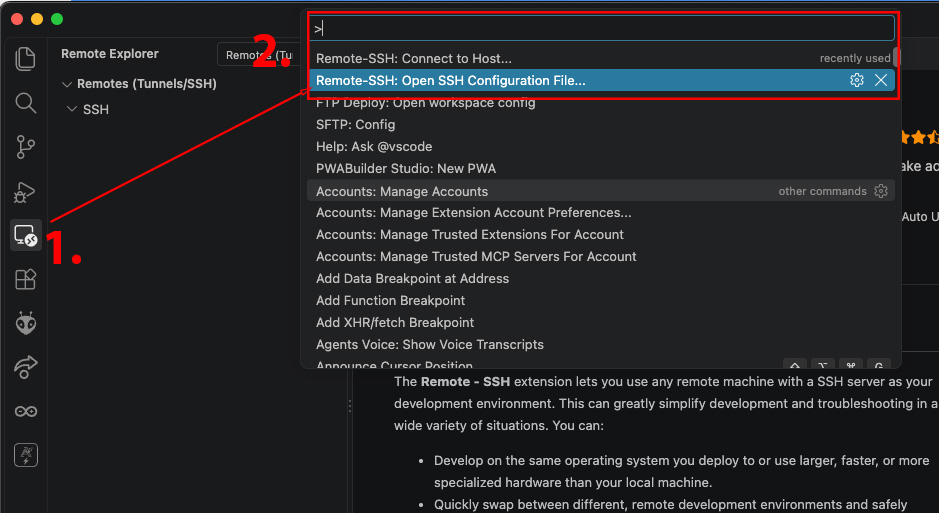
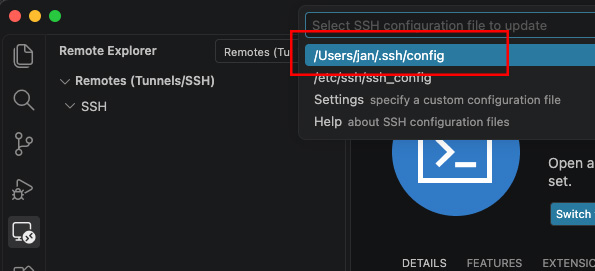
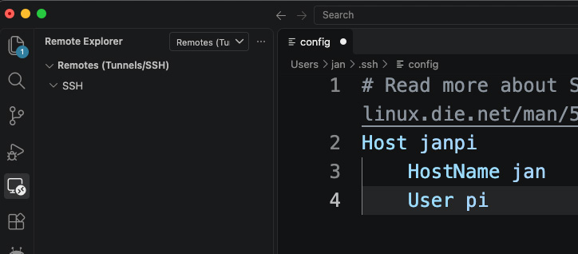
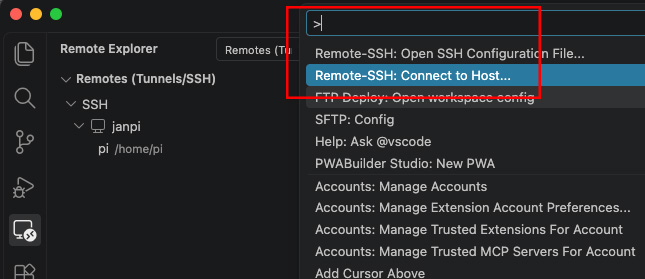
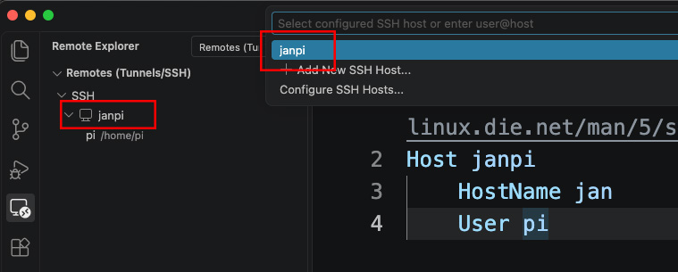
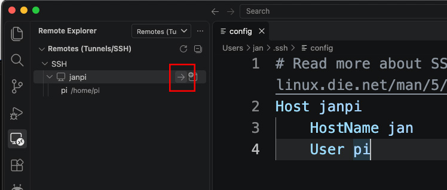
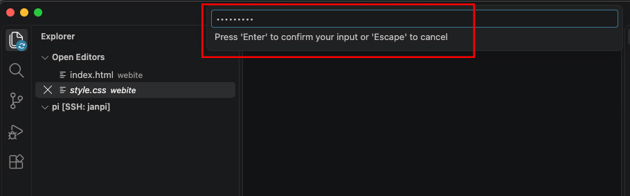
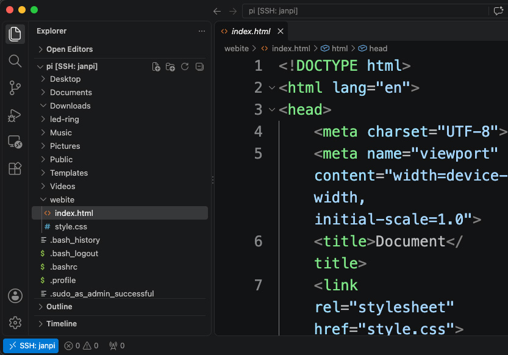

# Raspberry Pi Filesystem in VS Code

Vorteile:

- File Operations ganz ohne Unix Comands.
- Dateien editieren in einem anständigen Editor mit KI, Syntax-Highlighting und Maus

## Schritt 1: Remote-Erweiterung in VS Code installieren

- Öffne VS Code.
- Installiere die Extension `Remote - SSH` (von Microsoft).

## Schritt 2: SSH-Konfiguration anlegen

- Drücke in VS Code die Tastenkombination `Cmd + Shift + P`, um die Befehlspalette zu öffnen.
- Wähle `Remote-SSH: Open SSH Configuration File...`
  
- Wähle die vorgeschlagene Datei aus (bei Mac meistens `/Users/[dein_benutzername]/.ssh/config`).
  
- In der Datei muss stehen:

  ```
  Host SomeFunnyName
    HostName your_hostname
    User your_username
  ```

  Beispiel:

  ```
  Host janpi
    HostName jan
    User pi
  ```

  

- Speichere die Datei und schliesse sie.

## Schritt 3: Mit dem Raspberry Pi verbinden

- Wähle `CMD + P`und dann `Remote-SSH: Connect to Host...`
  
- Wähle deinen Server:
  
  Alternativ kann man auch den Pfeil drücken:
  
- Gib das Passwort ein, z.B. `raspberry`.
  
- Links ist nun das Dateiverzeichnis zu sehen. Dazu musst du in VS Code den Explorer angewählt haben (`Cmd + Shift + E`). Rechts kann man die Dateien komfortabel bearbeiten.
  

Geschafft! über `Cmd + J`kannst du das Terminal öffnen, welches direkt auf dem RPi läuft.
Klicke
