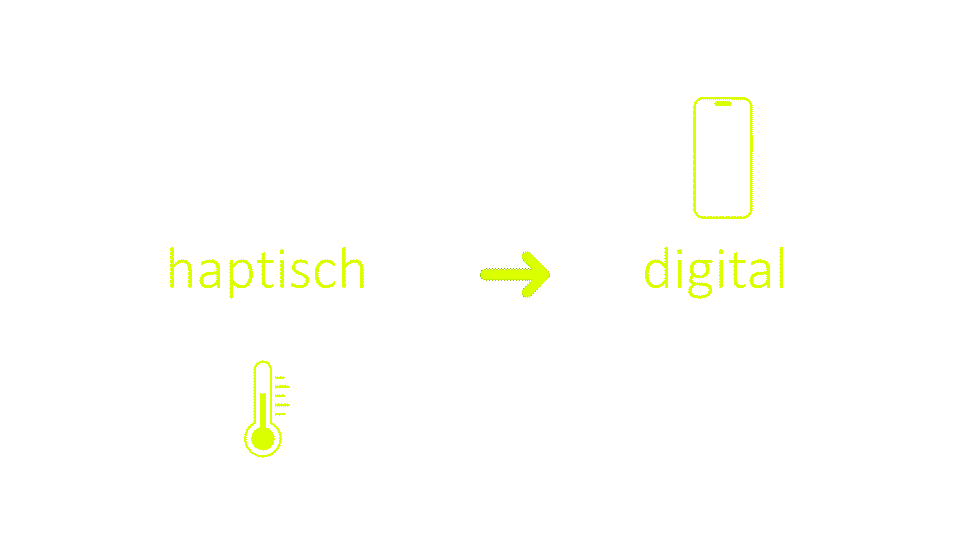

# im5_physical_computing

Mit Sensoren fangen wir die Umwelt ein und bringen die physische und die digitale Welt zusammen. Wir werden mit verblüffend einfachen Mitteln z. B. eine eigene Mess-/ Geocache-Station oder einen Wächter für den WG-Kühlschrank bauen bzw. ein beliebiges anderes kreatives Szenario angehen. 
Wir werden auf spielerische Weise mit dem vielversprechenden Internet of Things (IoT) vertraut, erproben praxisnahe Projektarbeit in interdisziplinären Teams und ergründen die Zusammenhänge unterschiedlicher Medientypen.

## Inhaltsverzeichnis

wird noch fleissig verlinkt