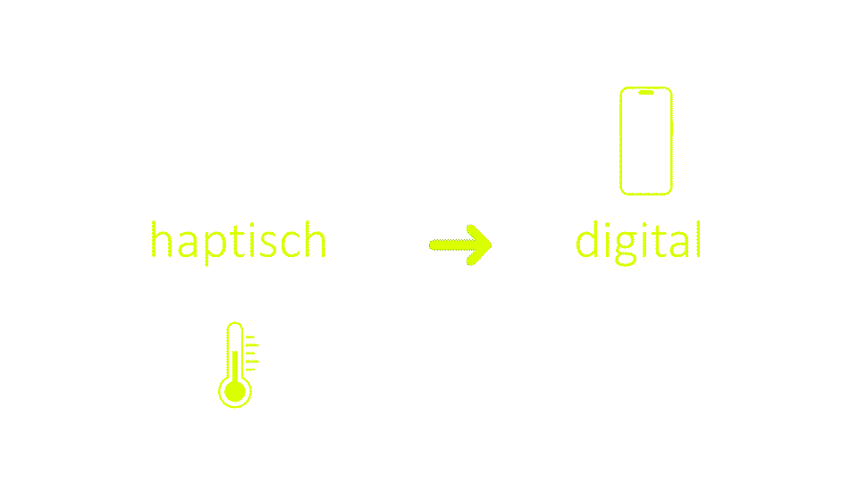

# IM 4 Physical Computing

Dieses Repository begleitet den Kurs Interaktive Medien 4 (Schwerpunkt Physical Computing) im Studiengang Multimedia Production an der FH Graubünden.

## Kurs-Trailer

[YouTube-Video ansehen](https://youtu.be/h6-Z-r78Ez0)

## Kurs-Materialien

* [Slides](https://docs.google.com/presentation/d/1bMKBpBUwZAxlKJm8mf3_WIEgtCDJ0X7gMcnHfRJWGAM/preview)
* [Video-Kurs_Playlist](https://www.youtube.com/playlist?list=PLS1hZNcGg7eGFIm6nnktxsdJ1-RdCZI3t)

## Beschreibung

Der Kurs Physical Computing bricht die Grenzen zwischen unterschiedlichen MMP-Bereichen wie IM, Live Com, Visua und Creative Technology. Die Studierenden nutzen Webtechnologien zur Kommunikation zwischen analogen / haptischen und digitalen Medien. Dieser Kurs hilft ihnen, bekannte Konzepte der interaktiven Medien auf spielerische Weise auf verschiedenste MMP-Vertiefungen zu übertragen, auch abseits des Webdesigns. Als Generalisten erhalten sie ein Grundverständnis für vernetzte Systeme und werden dazu befähigt, verschiedene Medientypen miteinander zu kombinieren.

Im praktischen Seminar bekommen sie einen Überblick über ua. Sensoren und Aktoren. 
Anders als in den Vorsemestern werden mit Hilfe von Sensoren die Daten selbst generiert. Die Studierenden erschliessen sich mit Hilfe von Maker Kits, wie physische und digitale Komponenten (z. B. Website) miteinander kommunizieren. Im Semesterprojekt machen sie unterschiedliche Medientypen zu einer Einheit. Mit Hilfe von 3D-Druck entstehen interaktive Gadgets, die zeitgemäss per Web-UI gesteuert oder ausgelesen werden. Das Semesterprojekt bietet reichlich kreativen Spielraum. Beispiele: Mess-Station. Geocache-Station, Wearable, Smart Home Steuerung, Digitalisierung einer analogen Lösungen, usw.

Die Studierenden werden mit dem vielversprechenden Internet of Things (IoT) vertraut und erproben praxisnahe Zusammenarbeit in interdisziplinären Projekten - bei sinnvollem Einsatz von KI-Hilfsmitteln.
Beim Hardware Prototyping gehen UX und Technik nahtlos ineinander über.
Elektronik-Kenntnisse werden nicht vorausgesetzt.

## Ablauf

Siehe Unter-Verzeichnisse
