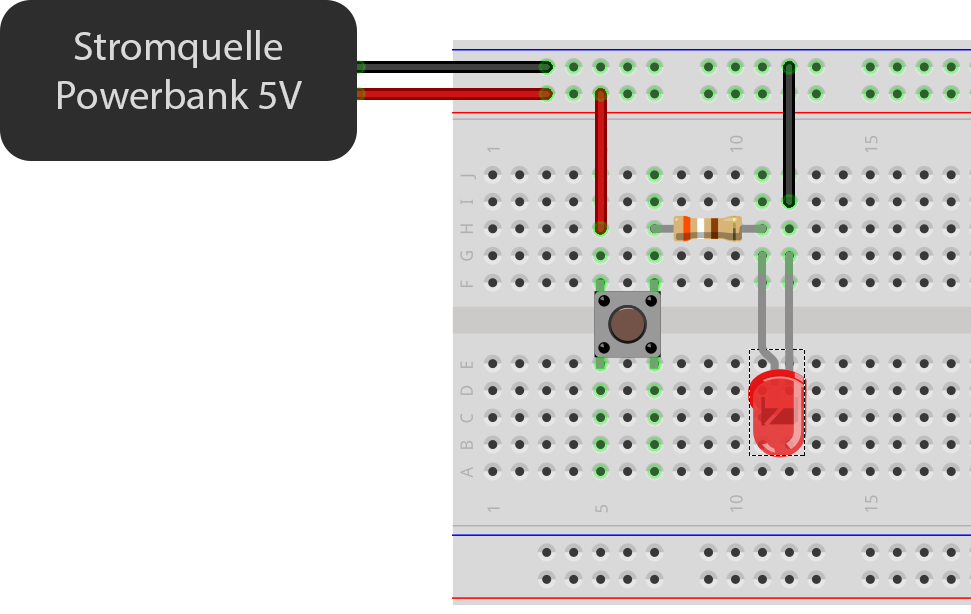
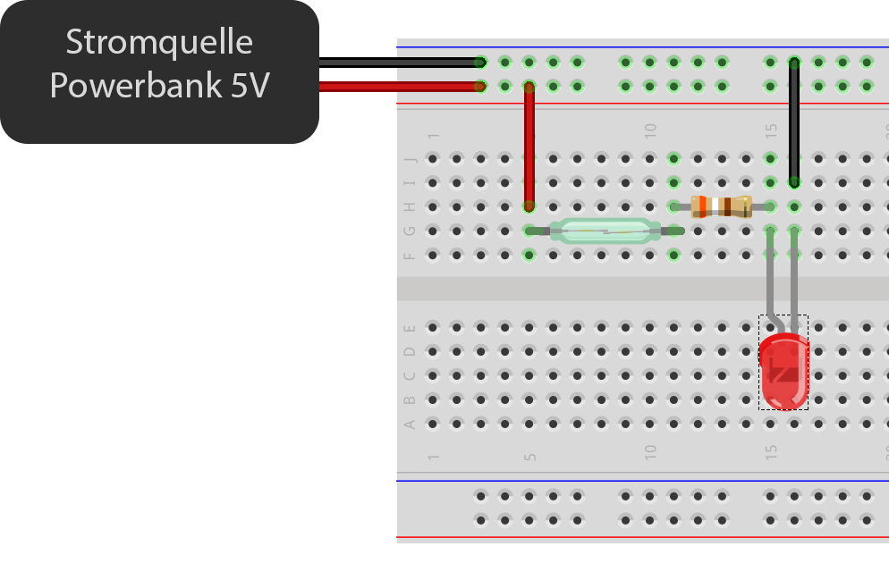
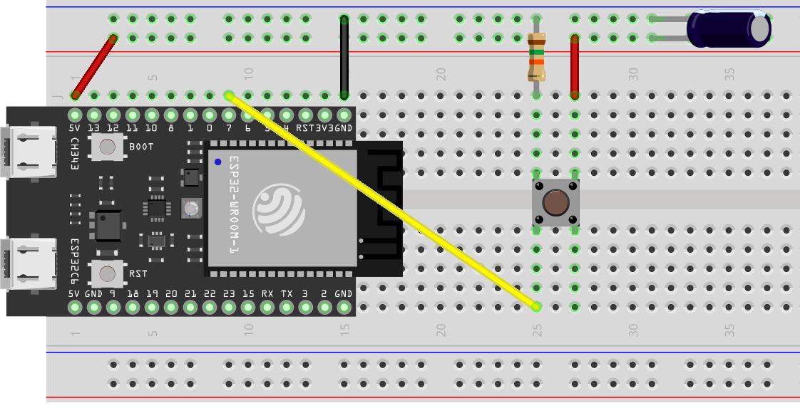
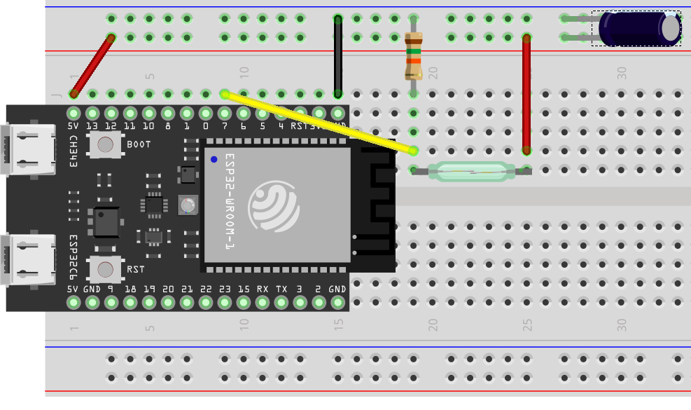

# im5_physical_computing

Mit Sensoren fangen wir die Umwelt ein und bringen die physische und die digitale Welt zusammen. Wir werden mit verblüffend einfachen Mitteln z. B. eine eigene Mess-/ Geocache-Station oder einen Wächter für den WG-Kühlschrank bauen bzw. ein beliebiges anderes kreatives Szenario angehen. 
Wir werden auf spielerische Weise mit dem vielversprechenden Internet of Things (IoT) vertraut, erproben praxisnahe Projektarbeit in interdisziplinären Teams und ergründen die Zusammenhänge unterschiedlicher Medientypen.

## Task 1: Einfacher Stromkreis

Wir bauen zunächst einen einfachen Stromkreis, der geschlossen wird, 
wenn ein Button gedrückt wird.

### Steckschema:

ersetze Button eg. durch Magnetsensor

## Task 3: ergänze Schaltung durch Microcontroller

Stecke folgende Schaltung, bei der mit einem Button reguliert wird, ob am Input eines Microcontrollerboards Spannung anliegt oder nicht. Diesen Impuls nutzen wir später in der Software als Trigger.

Steckschema:

## Task 4: Arduino IDE installieren

Was genau der Microcontroller macht, wenn z. B. Spannung an einem Input anliegt, legt das Programm fest, das wir auf ihn laden müssen.

Der Microcontroller erleichtert uns die Arbeit, indem wir nicht alle Aufgaben mit elektrischen Schaltungen lösen müssen.

Dazu installieren wir die Arduino IDE, 
mit der wir Programme für den Microcontroller entwickeln können und sie auf ihn laden können.
 
[Video Tutorial](https://kein-bock.ch)

## Task 5: Button-Input am Computer nutzen

[Arduino Code](01_read_sensor/Button.ino)
Steckschema bleibt gleich wie bei Task 3.

## Task 6: Button-Input ersetzen durch andere Sensoren

### Task 6a: Magnetsensor

Ersetze Button durch Reedschalter (Magnetsensor)

Steckschema:

